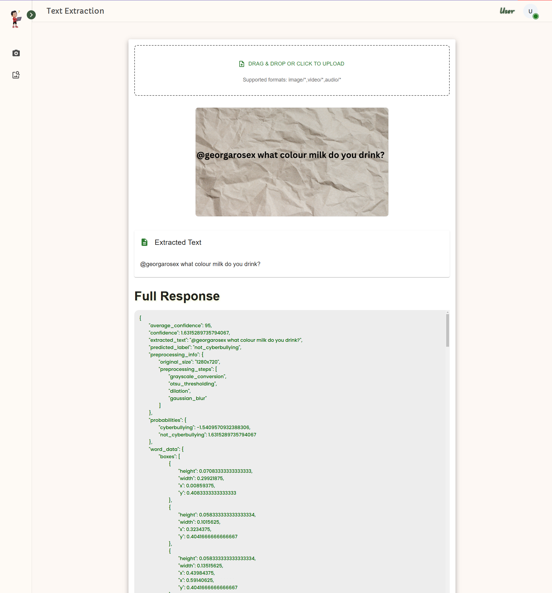
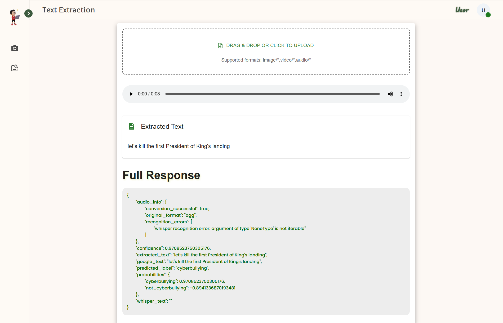
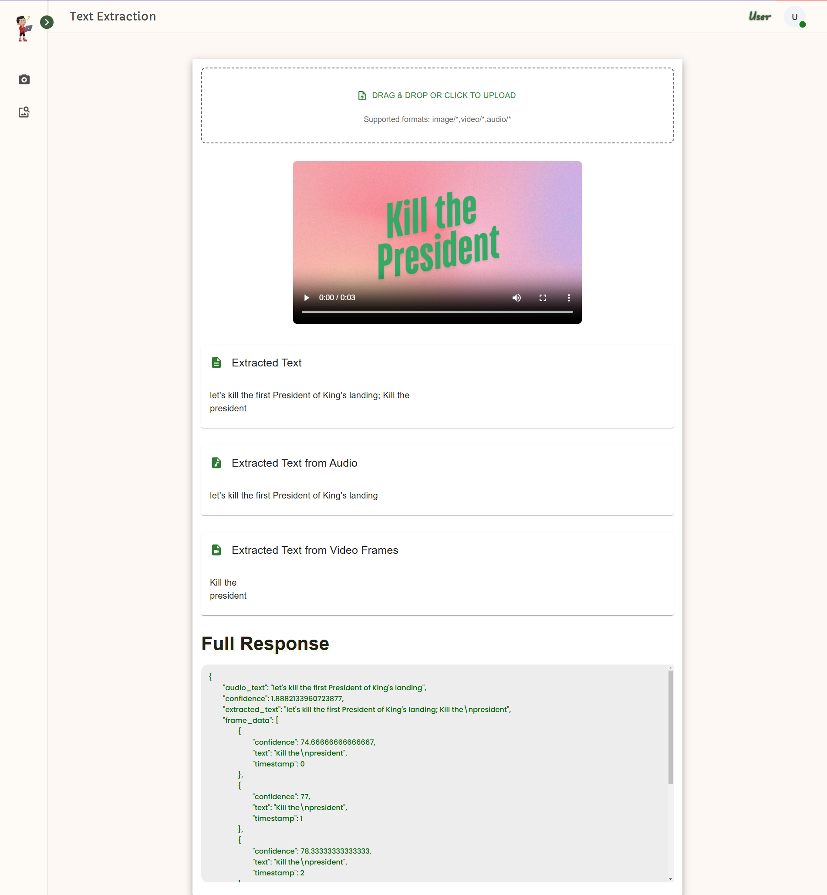
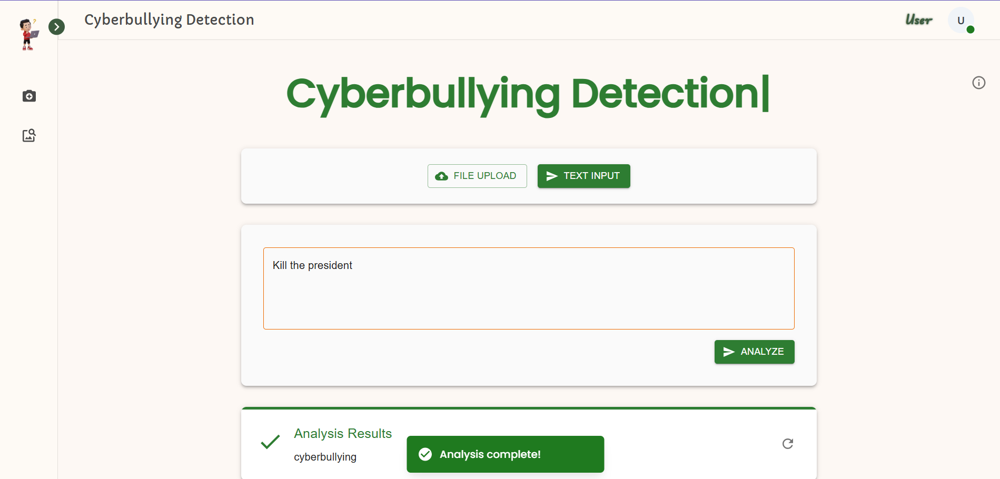
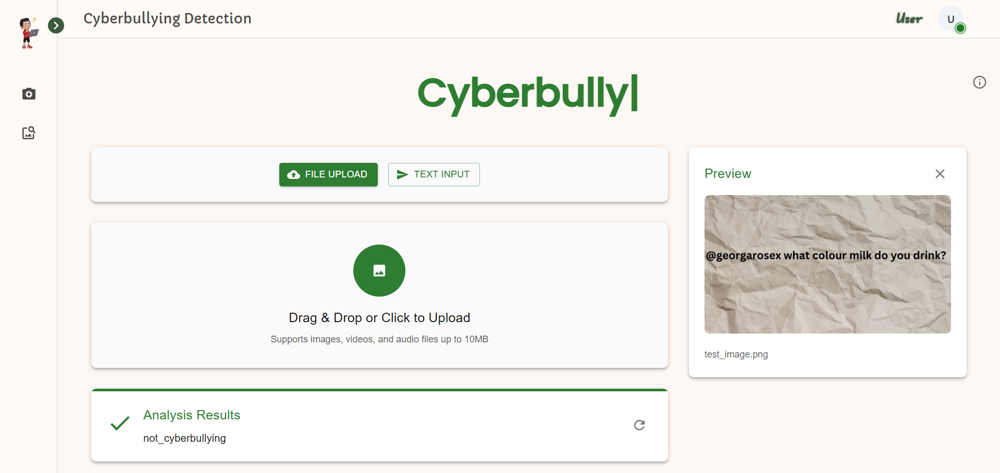
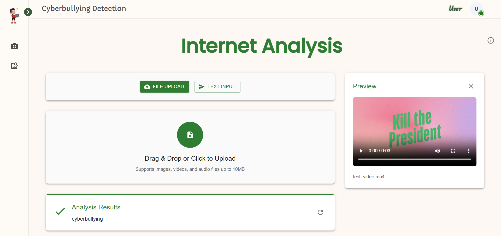

# Cyberbullying Detection using BERT

To view the demo, [click here](https://github.com/kadirikumar-uptycs/Cyberbullying_Classification/blob/main/result.mp4) to download and play the video locally.

## Current Features

1. Text Extraction from Image ✅, Audio ✅ and Video ✅.

   

   

   
2. Identify cyberbullying from the uploaded Text or File.

   

   

   

### Allowed File Formats

1. Image - `jpg`, `jpeg`, `png`, `bmp`, `tiff` etc...
2. Audio - `wav`, `mp3`, `ogg`, `flac` etc...
3. video - `mp4`, `avi`, `mov`, `mkv` etc..

## Backend Setup

### Requirements

- Python 3.8+
- pip (Python package installer)
- flask==2.2.5
- Flask-Cors
- torch
- transformers
- numpy
- pandas
- scikit-learn
- Pillow
- opencv-python
- typing
- SpeechRecognition
- moviepy==1.0.3
- pytesseract
- pyaudio
- soundfile
- whisper

### Dependencies

1. **Download BERT Model Weights**

   - Download the weights file from Google Drive: [weights.pth](https://drive.google.com/file/d/1JJbCi_bk_65H1uu3ge2o68IGFAXjsjdM/view?usp=sharing).
   - Move the downloaded `weights.pth` file to the `backend\app\weights` folder.
2. **Download and Install Tesseract**

   - Download the Tesseract installer from this [link](https://github.com/UB-Mannheim/tesseract/wiki).
   - Install Tesseract and add the installation directory to your system's PATH.
3. **Download FFmpeg**

   - Visit [FFmpeg Downloads](https://ffmpeg.org/download.html) and choose Windows builds or just download from [Link](https://www.gyan.dev/ffmpeg/builds/ffmpeg-release-essentials.zip).
   - Extract the downloaded zip file.
   - Copy the extracted folder to `C:\ffmpeg`.
   - Add `C:\ffmpeg\bin` to your system's PATH environment variable.

### Installation

1. Navigate to the `backend` directory:

   ```sh
   cd backend
   ```
2. Install the required packages:

   ```sh
   pip install -r requirements.txt
   ```

### Running the Backend

1. Ensure all the dependencies are installed.
2. Run the backend server:

   ```sh
   python run.py
   ```

## Frontend Setup

### Requirements

- Node.js
- npm (Node package manager)
- MUI
- react-router-dom
- framer-motion

### Installation

1. Navigate to the frontend directory:

   ```sh
   cd frontend
   ```
2. Install the required packages:

   ```sh
   npm install
   ```

### Running the Frontend

1. Start the development server:

   ```sh
   npm start
   ```
2. Open [http://localhost:17293](http://localhost:17293) to view it in your browser.

## License

Please read the full license text in the directory to understand the permissions, restrictions, and requirements for usage, redistribution, and modification.
